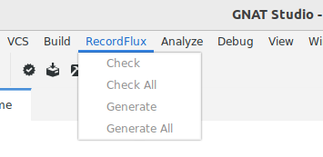

Introduction
============

This document describes RecordFlux, a domain-specific language (DSL) and toolset for the creation of verifiable communication protocol implementations.
After stating the problems RecordFlux helps solving, the manual outlines the required prerequisites and explains how to install and set up the tool.
Subsequent sections give an introduction to the protocol verification process, describe the available tools and how they work together, and present introductory examples for message as well as protocol state machine formalization.

Binary Data Formats and Communication Protocols
-----------------------------------------------

`BrakTooth <https://asset-group.github.io/disclosures/braktooth/>`_, `Infra:Halt <https://www.forescout.com/research-labs/infra-halt/>`_, or `Heartbleed <https://heartbleed.com/>`_ are just a few of the high-profile security vulnerabilities related to communication protocols that have made it into the news in recent years.
In fact, there are many more, but not all of them have a logo, a dedicated website and get the same amount of attention.
Nonetheless, they have important aspects in common: they may be exploited to target critical infrastructure, they can create a serious supply chain security issue by affecting millions of devices in various configurations, and they are typically hard to prevent, identify or mitigate.
This is especially problematic as paradigms like Edge Computing, Predictive Maintenance or Autonomous Driving require ever more complex protocols and increased communication.

The reasons for those severe and recurring security vulnerabilities are manifold.
Interaction between software components is governed by protocol and format specifications.
Most of those specifications are incomplete, ambiguous, and even contradictory English language documents which need to be translated into software implementations manually.
In addition to logic errors introduced during mandraulic translation phases, critical flaws are often poorly mitigated by widespread unsafe programming languages.
It is not possible to express or check precise invariants characterizing the desired behavior, either at the source code or specification level.
Consequently, many implementations contain severe security vulnerabilities waiting to be discovered and exploited by malicious actors.

Using standardized formats and protocols and relying on widespread implementations with good quality assurance can help to lower the risk of zero-day exploits.
However, high profile vulnerabilities in commonly used protocol stacks, as found in `Ripple20 <https://www.jsof-tech.com/disclosures/ripple20/>`__ or `Amnesia:33 <https://www.forescout.com/research-labs/amnesia33/>`__, demonstrate that this by no means guarantees good security.

While standard implementations receive at least a certain level of scrutiny by the open source community and independent researchers, the situation is even worse for custom data formats and protocol implementations.
Specifications (if present at all) and implementations are often only reviewed by a few people.
Ad hoc design decisions resulting from urgent project needs complicate parsers and state machine implementations.
Common pitfalls, which experienced protocol designers and implementers learn to avoid, like failing to check the length of a received message or making sure that privileged protocol states cannot be reached without prior authorization, can easily cause severe security problems in one-off in-house protocol implementations.

Problems solved by RecordFlux
-----------------------------

With the `SPARK language and toolset <http://docs.adacore.com/live/wave/spark2014/html/spark2014_ug/index.html>`__, programs can be proven to contain no runtime errors and to respect at all times the contracts with which the code is annotated.
This process is highly automated and has been used successfully in mission critical software, for example in Aerospace & Defense, Avionics and Confidential Computing.
However, the precision and trustworthiness that is gained comes at the price of additional effort for designing the software within the provable feature set of SPARK, specifying contracts, and guiding automatic theorem provers towards successful verification.
The amount of code necessary for real-world data format and protocol implementations can often exceed the limit of what is formally provable with a manual implementation.

The RecordFlux toolset addresses this challenge by providing a high-level language tailored towards data formats and communication protocols which is precise and expressive enough to generate complex, formally-provable source code automatically.
Its domain-specific language is used to precisely describe complex binary data formats and communication protocols.
Through the toolset, users can formally verify specifications, generate provable SPARK code, and validate specifications using communication traces and existing implementations.

The formal specification in RecordFlux’ language serves as a single source of truth in this process.
Due to its abstract nature and its specialized support for binary formats and communication protocols, RecordFlux specifications can be written and understood by domain experts who are not necessarily programmers or verification engineers.
The SPARK code that is generated from a valid RecordFlux specification can automatically be proven at the SPARK "gold" level.
It contains no runtime errors like buffer overruns and integer overflows, and key properties – namely the behavior of the program with respect to the RecordFlux specification – are shown to be fulfilled at any time.

The RecordFlux language is expressive enough to define complex real-world binary messages and data formats.
It can be used to precisely specify permitted value ranges, invariants that need to be maintained at all times, and complex dependencies between the elements of messages.
The behavior of a protocol can be formally described by finite state machines which tightly integrate with the formal message specification.
While abstract communication channels are used to define the integration with external components, external functions can be used to integrate with hand written code in a safe manner.

The automated correctness proofs performed at the specification level (i.e. before generating any source code) guarantee the following properties for message specifications:

-  Determinism (no contradictory conditions)
-  Liveness (no cycles)
-  Reachability (no unused fields)
-  Coherency (no overlaps)
-  Completeness (no holes)

Consequently, the resulting message parsers and message serializers are – by construction – free from many issues that plague manual implementations of communication protocols.
As functional correctness is proven statically, parsers guarantee that received messages comply with their specification, serializers ensure the creation of correct messages and state machines provide the specified protocol behavior.

The extensive integrity guarantees ensured for the generated code do not compromise performance and the compiled code has a small enough footprint to be usable in resource constrained, deeply embedded systems.

Prerequisites
-------------

The RecordFlux toolset generates code in the `SPARK language <https://www.adacore.com/sparkpro>`__, a formally analyzable subset of Ada 2012.
AdaCore's `gnatprove` tool can be used to verify the source code produced by RecordFlux.
While most of the generated code can be proven automatically, integrating it into a SPARK application requires good knowledge of the SPARK concepts, language and tools.
The `SPARK Reference Manual <http://docs.adacore.com/live/wave/spark2014/html/spark2014_rm/index.html>`__ and the `SPARK Toolset User's Guide <http://docs.adacore.com/live/wave/spark2014/html/spark2014_ug/index.html>`__ give an overview of the SPARK language, process and toolset.
This manual assumes familiarity with SPARK and a working setup of the SPARK tools.
AdaCore’s interactive training platform `learn.adacore.com <https://learn.adacore.com/>`__ features extensive course material on SPARK, among other relevant topics such as mixed-language and embedded development.

While SPARK can be used to statically verify properties of the generated source code without compiling it, the GNAT compiler is required to produce a binary that can be deployed onto a target.
RecordFlux makes very few assumptions on the target platform and the generated code can thus be used on various CPU architectures, native as well as cross configurations, and anything ranging from network servers to embedded systems.
This manual assumes a working GNAT installation for the target platform as well as familiarity with the respective GNAT tools.
See the `GNAT documentation <https://www.adacore.com/documentation#GNAT>`__ for details.

RecordFlux is integrated into GNAT Studio, AdaCore’s lightweight multi-language IDE.
For the integration, a working GNAT Studio installation and a correctly set up RecordFlux plug-in are required.
See the `Installation section <#gnat-studio-modeller-plugin>`__ for details.
The use of GNAT Studio is not mandatory – all RecordFlux features can also be used on the command line.

The RecordFlux Simulator is a library which can be used to load RecordFlux specifications and dynamically interact with data or servers implementing the respective protocol from within a Python program.
It is an optional component which does not require code generation or compilation.
When used, it requires familiarity with Python 3 and of course a working Python environment.

Installation
------------

System requirements
~~~~~~~~~~~~~~~~~~~

RecordFlux is supported on 64-bit Linux systems and should work on a variety of Linux distributions.
The officially supported distributions are:

- Red Hat Enterprise Linux 7, 8, and 9
- SuSE Linux Enterprise Server 12 and 15
- Ubuntu 20.04 LTS and 22.04 LTS

The software has successfully been used on various other versions of Linux, including Arch Linux and Debian.

For installing RecordFlux itself, a *native* GNAT compiler for the host system must be installed.
The following versions of GNAT are supported:

-  GNAT Pro 22.2, 23.2, 24.2 and 25.0
-  GNAT Community 2021
-  FSF GNAT 11.2, 12.2, 13.2 or 14.1

A working installation of Rust 1.77 or newer must be installed.
Rust 1.77 can be installed using `rustup <https://rustup.rs/>`__:

.. code:: console

   $ curl --proto '=https' --tlsv1.2 -sSf https://sh.rustup.rs | sh -s -- -q -y --profile default --target x86_64-unknown-linux-gnu --default-toolchain 1.77

The latest release of GNAT Pro for Rust is also supported.

For compiling the generated code, one of the following versions of GNAT is required:

-  GNAT Pro 21.2, 22.2, 23.2, 24.2 and 25.0
-  GNAT Community 2021
-  FSF GNAT 11.2, 12.2, 13.2 or 14.1

A successful installation of the native toolchain can be verified on the command line as follows:

.. code:: console

   $ gprbuild --version
   GPRBUILD Pro AA.BB (YYYYMMDD) (x86_64-pc-linux-gnu)
   Copyright (C) 2004-2022, AdaCore
   ...

The following external dependencies must be installed:

-  GMP, `libgmp-dev` (Debian/Ubuntu), `gmp-devel` (Fedora) or `gmp` (Arch Linux)
-  Graphviz (if graph visualization is used), `graphviz` in most distributions.

If FSF GNAT is used, the `GNATcoll iconv binding <https://docs.adacore.com/live/wave/gnatcoll-iconv/html/gnatcoll-iconv_ug/index.html>`__ must also be installed.

To run RecordFlux one of the following Python versions is needed:

-  Python 3.9
-  Python 3.10
-  Python 3.11
-  Python 3.12

In addition, the Python package installer `pip` is needed to install RecordFlux from the Python Package Index (PyPI).
The tool can be installed using either the system package manager (`python3-pip` on Debian/Ubuntu/Fedora, `python-pip` on Arch Linux) or any other way described in the pip `installation guide <https://pip.pypa.io/en/stable/installation/>`__.

For the formal verification of the generated code, one of the following SPARK Pro versions is required:

-  SPARK Pro 24.2 or 25.0

If you plan to use the RecordFlux Modeller, GNAT Studio needs to be installed and set up.

RecordFlux
~~~~~~~~~~

Installing RecordFlux using pip requires an internet connection with access to the `Python Package Index (PyPI) <https://pypi.org/>`__ and a working GNAT installation.
The following command will install RecordFlux and all required dependencies:

.. code:: console

   $ pip3 install RecordFlux

Alternatively, RecordFlux can be installed system-wide (run as root user) or into a virtual environment (run from within an activated `venv`).
To check whether the installation was successful and the RecordFlux executable is in your path, request the version from the CLI:

.. code:: console

   $ rflx --version
   RecordFlux 0.9.0
   RecordFlux-parser 0.13.0
   ...

Once installed, the following command can be used to upgrade RecordFlux to the latest available version:

.. code:: console

   $ pip3 install RecordFlux --upgrade

VS Code Extension
~~~~~~~~~~~~~~~~~

The VS Code extension adds support for the RecordFlux language to VS Code.
After the installation of RecordFlux, the extension can be installed using the CLI:

.. code:: console

   $ rflx install vscode

GNAT Studio Modeller Plugin
~~~~~~~~~~~~~~~~~~~~~~~~~~~

The RecordFlux Modeller is integrated into GNAT Studio as a plugin which needs to be installed before use.
After installation of RecordFlux, run the installation procedure on the command line:

.. code:: console

   $ rflx install gnatstudio

Should your GNAT Studio settings directory be different from `$HOME/.gnatstudio`, the installation path can be changed using the parameter `--gnat-studio-dir`.

For the installation to become effective, GNAT Studio must be restarted.
If the installation was successful, a RecordFlux menu will be available:

