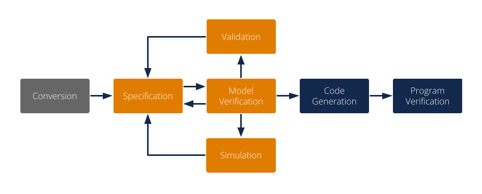
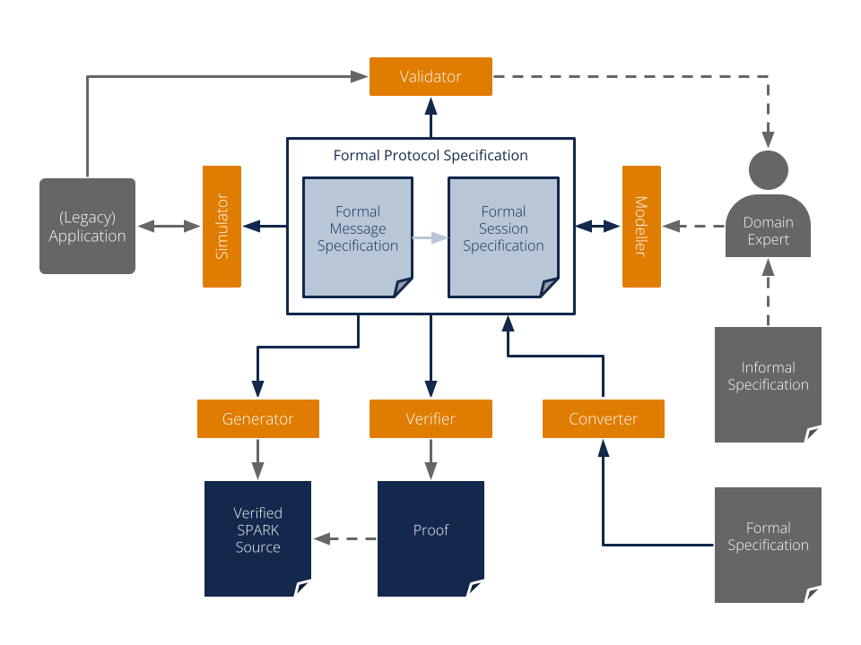
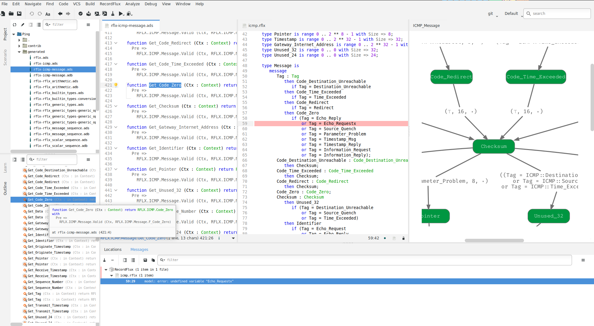
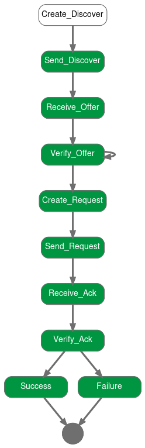
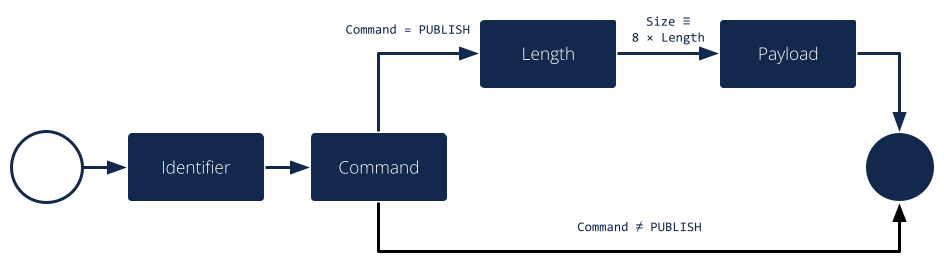

Overview
========

This section provides an overview of the protocol verification process, the parts of RecordFlux involved in working with binary communication protocols as well as some initial examples.
For a complete description of the RecordFlux language refer to the `RecordFlux Language Reference <../recordflux_lr/>`__.

The Protocol Verification Process
---------------------------------

Communication protocols don’t usually have a formal specification today, but are typically specified in imprecise English language texts.
There are efforts to establish a formal process to specify, e.g., internet protocols, but until such a process has been defined and widely adopted, additional work is needed to create formal specifications from informal ones.
This section outlines a typical process starting from an informal specification leading to a formally verified protocol implementation.

The process starts with the optional *Conversion* step, where the protocol in question or part of it is translated from a machine-readable input specification into a formal RecordFlux specification.
As mentioned above, only few protocols offer such a specification today.
However, the `Internet Assigned Numbers Authority (IANA) <https://www.iana.org/>`__ maintains a repository of machine-readable `Number Resources <https://www.iana.org/numbers>`__ for a variety of protocols.
Those definitions can be automatically converted into RecordFlux specifications to improve one of the most tedious tasks of protocol formalization, namely the correct translation of long lists of name / constant pairs.

A main activity when creating a formally verified protocol implementation is clearly the actual *Specification* of the machine readable formal definition of the protocol.
Working from a paper specification, the RecordFlux user can use the tool's language to express basic data types, the format of messages and the behavior of communicating entities.
To improve maintainability and to structure the specification in a coherent way, multiple specification documents can reference each other to form the overall specification.
The language is designed to be modular: protocols do not need to “know” each other, and two protocols can be associated with each other independent of their respective specifications.
In accordance with many protocol layering approaches, this allows for the creation of protocol libraries with reusable building blocks.

During specification development one question is of central importance: Does the formal specification correspond to the protocol?
The process of ensuring that the correct thing has been specified is called *Validation*.
As even the source specification may be vague, incorrect, contradictory or simply different from how the protocol is being implemented in practice, checking the formal specification against the output of existing implementations or protocol samples is of great value.
The RecordFlux toolset provides ways to do exactly this: check whether a valid protocol sample is accepted by the specification, or whether an invalid sample is correctly rejected.
The validation will typically be done while developing the formal specification, such that its validity is established incrementally.

Similar in its goals, but different in terms of process and implementation is the optional *Simulation* step.
While for validation the focus is mostly on the correctness of message formats, simulation allows for direct interaction with existing implementations.
To validate the formal specification, it can be loaded in a Python program and used to receive, check and send messages adhering to the protocol.
While the main objective is to detect unexpected behavior, it can also be used to build Python tools accompanying the formally verified protocol stack with little effort.
Of course the generated code could be used to interact with existing software, too.
However, rapid prototyping and the vast source of third-party libraries make a Python environment a much more efficient choice.

The *Model Verification* step answers another question: Does the formally specified protocol have the desired properties?
It’s worth noting that this is different from the goals of validation.
Validation is to ensure that we do the right thing, verification is to ensure that we do the thing right.
The model verification built into RecordFlux will typically be done iteratively during specification development.
It ensures a number of static properties, such as determinism of the message parser or that generated code can always be proven to contain no runtime errors.
There are also user-defined properties that are verified at the model level, e.g. that user-defined transitions are not statically false.

When the RecordFlux model has successfully been verified, the Code Generation phase transforms it into SPARK source code.
It can be combined with hand-written SPARK, Ada, or C code and compiled into binaries using the GNAT compiler.
The code generation process can be tailored towards resource-constrained, embedded systems with precise control over memory allocation and buffer sizes.
As only few basic runtime functions are required, the generated code is suitable for environments with minimal runtimes.

An explicit design goal of RecordFlux is that all code generated from a successfully verified model can automatically be proven correct, without a need for user modifications or interactive proofs.
This is done in the Program Verification step where the generated code, together with the hand written code it may be integrated in, is verified using the SPARK toolset.

The RecordFlux Toolset
----------------------

As outlined above, a domain expert creates the formal representation of a protocol in the RecordFlux language.
Having a text representation, RecordFlux specifications can be produced with any IDE or text editor, managed in version control systems, or compared using text comparison tools.
However, the RecordFlux Modeller provides additional capabilities tailored to protocol specification development.
A graphical representation of messages and state machines helps users to understand the structure of more complex specifications.
The specification can be edited side-by-side with generated code, handwritten code, and other relevant artifacts.
All specifications, or only a single specification file, can be checked, and SPARK code can be generated directly from within the Modeller.

All functionality in the Modeller is also available on the command line through the `rflx` command.
This is RecordFlux’s main CLI, which has a number of subcommands of the form `rflx <subcommand>`.
Some functionality is available only on the command line.
See the output of `rflx --help` for a list of all subcommands and global options and use `rflx <subcommand> --help` to show options specific to a particular subcommand.

The Converter, available through the `rflx convert` subcommand of the RecordFlux CLI, provides the possibility to convert IANA Number Resources into RecordFlux specifications.
Given a Number Resources file in XML format and an output directory, the converter produces a RecordFlux specification containing representations of the respective number definitions.

To check whether a given specification is correct, the Verifier performs a number of formal verification steps.
The tool is available from within the Modeller (`RecordFlux > Check` or `RecordFlux > Check All`) but can also be run from the command line using the `rflx check` interface.
The CLI exits with a non-zero status code in case of errors and thus can be easily integrated into a CI/CD pipeline.
With the command line interface, arbitrarily many (unrelated) specifications can be checked at once.

Similar to the Verifier, the Generator is available from within the Modeller as well as on the command line through the `rflx generate` interface.
As only successfully verified specifications are guaranteed to lead to provable SPARK code, the Generator automatically performs the verification, unless this is suppressed using the `--no-verification` switch (e.g. for known-good specifications that have been checked in a CI/CD pipeline).
SPARK source files are generated into the directory specified by the `-d` switch on the command line.
The result can be included in the list of source directories and analyzed by `gnatprove` as usual (see the `SPARK User’s Guide <https://docs.adacore.com/live/wave/spark2014/html/spark2014_ug/>`_ for details).

The Optimizer reduces the size of the generated state machine code.
In order to use the Optimizer, a project file for the SPARK code must be provided by the user and passed as an argument to `rflx optimize`.

The Validator is available through the `rflx validate` subcommand on the command line.
It can be used to check whether a message specification correctly formalizes real-world data, or vice versa, whether a given data sample corresponds to the specification.
Two types of samples can be used: valid samples which must be accepted by a specification (passed with the `-v` option) and invalid samples which must be rejected (passed with the `-i` option).
All samples must be raw binary files without any metadata.
There are two ways how samples can be provided to the tool and the same rules apply for both `-v` and `-i`.
If there are several samples of the same kind in one directory and the samples have a `.raw` file extension, then it is sufficient to just provide this directory.
Otherwise, the paths of the individual sample files must be provided one by one.
In the latter case the sample file can have any extension or even have no extension.
However, if it has an extension, then it must be included in the path as well.
There can be as many `-v` and `-i` options given to the tool as needed.
However, each of those options must have exactly one argument.
Raw packets can, e.g., be exported from packet analyzers like Wireshark or extracted from a PCAP file using `this script <https://github.com/AdaCore/RecordFlux/blob/main/tools/extract_packets.py>`__.
To facilitate execution within a CI/CD pipeline, the `--abort-on-error` switch causes the tool to exit with an error code if any samples are rejected.
Upon completion, the Validator will produce a report, with an option to display how much of a message has been covered:

.. literalinclude:: validator_example.txt
   :language: console

If more complex validation beyond checking messages is required, the Simulator can be used.
It allows loading RecordFlux message specifications into a Python program and using the resulting model to parse and generate messages at runtime.
While the code does not benefit from the formal guarantees of generated SPARK code, errors can be caught at runtime.
This makes the Simulator a useful tool during specification development to validate a specification against an existing real-world implementation.
An example of using the Simulator can be found in `examples/apps/ping/ping.py <https://github.com/AdaCore/RecordFlux/blob/main/examples/apps/ping/ping.py>`__ in the RecordFlux source repository.

The Visualizer can be used to create graphical representations of a formal RecordFlux specification.
It is available on the command line through the `rflx graph` command.
It creates images for all messages and state machines found in the specifications passed on the command line and stores them in the output directory specified by the `-d` switch.
By default, SVG images are created, but the `-f` switch may be used to select alternative formats like JPG, PNG or PDF.
The `-i` switch may be used to filter out state machine states which must not be included in the output, which can be helpful, for example, to eliminate error states which may complicate the non-error case unnecessarily.

.. code:: console

   $ rflx graph -d out dhcp_client/specs/dhcp_client.rflx

   Parsing dhcp_client/specs/dhcp_client.rflx
   Parsing dhcp_client/specs/ipv4.rflx
   Parsing dhcp_client/specs/dhcp.rflx
   Processing IPv4
   Processing DHCP
   Processing DHCP_Client
   Creating out/IPv4_Option.svg
   Creating out/IPv4_Packet.svg
   Creating out/DHCP_Static_Route.svg
   Creating out/DHCP_Option.svg
   Creating out/DHCP_Message.svg
   Creating out/DHCP_Client_Session.svg

First Steps
-----------

The example used here is a minimal binary publish-subscribe ("Pub-Sub") protocol (i.e., a message broker).
In the following sections we will first formally describe the message format using RecordFlux, generate SPARK code, and build a simple server which we then prove to contain no runtime errors.
In a subsequent section, we will also define the protocol behavior using the RecordFlux language which will give us an abstract formal definition of the protocol and further reduce the amount of hand-written code.

In our example protocol, there is only one single implicit channel that clients can subscribe to.
Once subscribed, a client may publish messages which the broker distributes to all other currently subscribed clients.
A client does not receive messages published by itself.
When finished, clients can unsubscribe from the broker and will no longer be able to publish or receive messages.

A number of status messages are used to communicate the result of an operation from the broker to the clients.
The `SUCCESS` message indicates that a `SUBSCRIBE`, `PUBLISH` or `UNSUBSCRIBE` operation completed successfully.
An `ERROR_NOT_SUBSCRIBED` message is emitted when a client tries to publish or unsubscribe while not currently subscribed, implying that a client has to be subscribed to publish.
An `ERROR_NO_SUBSCRIBERS` is sent by the broker if no other clients are subscribed when publishing information, which is considered an error in this example.
An `ERROR_MESSAGE_TOO_LONG` message is emitted when the published message exceeds an implementation-defined length, which may be shorter than the maximum possible message length.
An `ERROR` message is sent back in all other cases.

Example: A Formally-Verified Message Parser
~~~~~~~~~~~~~~~~~~~~~~~~~~~~~~~~~~~~~~~~~~~

The messages of our example publish-subscribe protocol are a binary format which is encoded as follows:

.. table::
   :widths: 15 15 40 30

   +-----------------+-------------------+--------------------------------+--------------------------+
   | Field           | Length [bits]     | Domain                         | Description              |
   +=================+===================+================================+==========================+
   | Identifier      | 12                | 1 <= `Identifier` <= 4000      | Unique client identifier |
   +-----------------+-------------------+--------------------------------+--------------------------+
   | `Command`       | 4                 | `SUBSCRIBE` = 1,               | Message type             |
   |                 |                   | `PUBLISH` = 3,                 |                          |
   |                 |                   | `UNSUBSCRIBE` = 4,             |                          |
   |                 |                   | `ERROR` = 11,                  |                          |
   |                 |                   | `ERROR_NOT_SUBSCRIBED` = 12,   |                          |
   |                 |                   | `ERROR_NO_SUBSCRIBERS` = 13,   |                          |
   |                 |                   | `ERROR_MESSAGE_TOO_LONG` = 14, |                          |
   |                 |                   | `SUCCESS` = 15                 |                          |
   +-----------------+-------------------+--------------------------------+--------------------------+
   | `Length`        | 8                 | 0 <= `Length` < 2^8            | Length of published      |
   |                 |                   |                                | payload in bytes,        |
   |                 |                   |                                | present only when        |
   |                 |                   |                                | `Command` = `PUBLISH`    |
   +-----------------+-------------------+--------------------------------+--------------------------+
   | Payload         | 8 * Length        | Arbitrary bytes                | Payload of published     |
   |                 |                   |                                | data, present only when  |
   |                 |                   |                                | `Command` = `PUBLISH`    |
   |                 |                   |                                | and `Length` > 0         |
   +-----------------+-------------------+--------------------------------+--------------------------+

As we can see, the message has several interesting properties which our formal specification needs to cover: Some of the fields are not multiple of 8 bits (`Identifier`, `Command`) or not byte aligned (`Command`).
While representable in the available bit width, not all values are valid for all fields.
For `Identifier`, the values 0 and 4001 .. 4095 are invalid and must be rejected.
Likewise, the `Command` field has invalid values (e.g., 2) which do not represent a valid message type.
There are also optional fields like `Length` and `Payload`, which are present only for messages where the `Command` field has the value 3 (i.e. `PUBLISH`).
Lastly, the `Payload` field has a variable length determined by `Length` field.

Files, Packages and Names
^^^^^^^^^^^^^^^^^^^^^^^^^

Let’s formalize our Pub-Sub message format in the RecordFlux language.
RecordFlux types (scalar types as well as messages) are defined in modules known as packages, whose syntax is inspired by SPARK.
There is exactly one package per file; the file name has to be the same as the package name, folded to lowercase, and the file extension is “rflx”.
We will use the name “Pub Sub” for our example protocol and create a file named `pub_sub.rflx` for the specification:

.. doc-check: rflx
.. code:: rflx

   package Pub_Sub is
      -- Type specifications (basic types, messages) go here
   end Pub_Sub;

Single line comments, as in SPARK or SQL, start with a double hyphen (`--`) and comprise all text until the end of the line.
There are no block comments in the RecordFlux language.

Names follow mostly the same rules as for the SPARK language: Letters A-Z, a-z, digits and underscores can be used.
A name must not begin with an underscore or a digit, and must not end with an underscore; consecutive underscores are also prohibited.
Names in RecordFlux are case-insensitive, i.e. `Pub_Sub` and `pub_sub` refer to the same thing.
Future versions of RecordFlux will also be case-preserving, hence it is already considered good practice to use identical casing for all appearances of a name.

Scalar Types
^^^^^^^^^^^^

To limit the size and allowed values of a numeric field in a message, we need to define a type that has the desired properties.
For the `Identifier` field we define a type that can represent values from 1 to 4000, inclusive, and whose instances occupy 12 bits:

.. doc-check: rflx,basic_declarations
.. code:: rflx

   type Identifier is range 1 .. 16#F_A0# with Size => 12;

Numbers, like in SPARK, are base 10 by default, but can be represented in arbitrary bases by using the `<base>#<value>#` notation.
In the above example we represent the upper limit of 4000 by its hexadecimal representation `16#F_A0#`.
Note, that single underscores (`_`) can be introduced into numeric literals in arbitrary positions to improve readability.

As for the package name, “`Identifier`” adheres to the naming rules stated above.
The range declares the lower, and upper bounds of a field of this type and the Size attribute defines the precise storage space of the type in bits.
For consistency, sizes in RecordFlux specifications are always defined in bits – without exception.
In the message definition below we will see how to deal with protocols that define lengths in terms of bytes.

Of course the upper bound must be consistent with the available space defined in the Size attribute.
If we were to define the above type with an upper bound of 5000 (which obviously does not fit into 12 bits), the RecordFlux toolset would flag our specification as illegal:

.. code:: console

   Processing Pub_Sub
   pub_sub.rflx:3:9: model: error: size of "Identifier" too small

We could proceed and define the Type field of our protocol as a 4 bit numeric value, similar to the Identifier field.
While we could even express the fact that the type field must not be zero by choosing 1 as the lower limit, there would still be values that will be accepted (e.g. 2) but which are invalid according to the protocol specification.
An enumeration type is much better suited to represent discrete choices as in the Command field:

.. doc-check: rflx,basic_declarations
.. code:: rflx

   type Command is
   (
      SUBSCRIBE => 1,
      PUBLISH => 3,
      UNSUBSCRIBE => 4,
      ERROR => 11,
      ERROR_NOT_SUBSCRIBED => 12,
      ERROR_NO_SUBSCRIBERS => 13,
      ERROR_MESSAGE_TOO_LONG => 14,
      SUCCESS => 15
   ) with Size => 4;

As before, the `type` keyword introduces a type named `Command` with a storage size of 4 bits.
The possible choices for the enumeration type are listed in parenthesis as pairs of name and value, separated by an arrow (`=>`).
Fields with an enumeration type are only considered valid if their value matches one of the enumeration choices and are rejected otherwise.
Refer to the section on `Always_Valid` enumeration types in the Language Reference on how to handle fields where all values are valid, but only some have names.

As with integer ranges, the RecordFlux toolset will protect the user from including values in the specification that cannot be represented in the available space.
If we changed the value of `SUCCESS` to `8#42#` (octal 42 / decimal 34), which does not fit into 4 bits, we get an error:

.. code:: console

   Processing Pub_Sub
   pub_sub.rflx:5:9: model: error: size of "Command" too small

Message Types
^^^^^^^^^^^^^

With the package and the interesting scalar types in place, we can formalize the actual message structure.
As can be seen in the format description, our pub-sub protocol message has the interesting property that some fields are only present under certain conditions.
Formalizing such a message is easy in the RecordFlux language and hints at an important property of its messages:
While simple messages may appear similar to SPARK records, or structs of linear fields in other languages, they are in fact arbitrarily complex directed acyclic graphs of fields.
The edges of those messages carry information about conditions, the starting position and bit size of subsequent fields, which may in fact depend on previous fields in the graph:

Just like scalars, messages are also types.
The specification for our pub-sub message is as follows:

.. doc-check: rflx,basic_declarations
.. code:: rflx

   type Length is unsigned 8;

.. doc-check: rflx,basic_declarations
.. code:: rflx

   type Message is
      message
         Identifier : Identifier;
         Command : Command
            then Length
               if Command = PUBLISH
            then null
               if Command /= PUBLISH;
         Length : Length;
         Payload : Opaque
            with Size => 8 * Length;
      end message;

This contains quite a few new constructs – let’s unpack them one by one.
The `Length` type is an integer type as we have used it for the `Identifier` previously.
It’s worth noting that the ranges of integers may contain arbitrary expression, such as exponentiation (`**`) or subtraction (`-`) in the example above.

A message is encompassed by a `message ... end message` block which contains a list of fields, edges, and conditions making up the message graph.
Readers familiar with other languages may notice that we call our message “`Message`” which appears to conflict with the `message` keyword.
The same is true for the message field “`Identifier`” which has the same name as the previously defined type.
Contrary to other languages (and SPARK in particular), RecordFlux’ language allows the use of keywords as type names, and keywords and type names as identifiers to give the user the greatest possible flexibility when formalizing an existing protocol.

Similar to records in SPARK, message fields are delimited by a colon (`:`) and terminated by a semicolon (`;`).
Thus `Field_Name : Field_Type;` declares a field with the name “`Field_Name`” of type “`Field_Type`”.
It gets interesting for optional fields: the `then` keyword creates an edge to another field explicitly, usually in conjunction with a condition marked by the `if` keyword.
In our example, the `Length` field follows the `Command` field if (and only if) the `Command` field contains the value `PUBLISH`.
As in SPARK, and unlike other languages, RecordFlux uses a single equal sign for comparison.
For enumeration types like `Command`, the enumeration element name has to be used rather than its numeric field value.

When no `then` keyword is present for a field, there is an implicit `then` keyword with the next field as a target, e.g. an implicit “`then Payload`” for the Length field in the above example.
Multiple `then`-clauses are allowed for a single field to define multiple edges to other fields under different conditions.
There may even be multiple edges (i.e. `then` keywords) leading to the same field; e.g., to model separate conditions that may cause a field to be present.
To indicate that a message ends when a specific condition is true, the `null` keyword can be used in a `then` clause.
In the above example, the message is considered complete when Command does not have the value `PUBLISH` (`then null if Command /= PUBLISH`).
If none of the `then`-clauses match for a given input, the message is considered invalid and rejected.

Among other things, the RecordFlux Verifier ensures that `then`-clauses are mutually exclusive, i.e. the resulting parser is deterministic.
If we changed the above example to contain two `then`-clauses for Command which are not mutually exclusive, our specification would get rejected:

.. doc-check: ignore
.. code:: rflx

         Command : Command
            then Length
               if Command = PUBLISH
            then Length
               if Command = PUBLISH or Command = UNSUBSCRIBE;

.. code:: console

   Processing Pub_Sub
   pub_sub.rflx:21:10: model: error: conflicting conditions for field "Command"
   pub_sub.rflx:23:19: model: info: condition 0 (Command -> Length): Command = Pub_Sub::PUBLISH
   pub_sub.rflx:25:19: model: info: condition 1 (Command -> Length): Command = Pub_Sub::PUBLISH or Command = Pub_Sub::UNSUBSCRIBE

Another noteworthy aspect of our example is the `Payload` field.
It is of type `Opaque`, one of RecordFlux’s few built-in types defining a sequence of arbitrarily many bytes.
While the content of opaque fields is not defined, their length can be specified using a `Size` attribute.
In our case, it defines the total length of the `Payload` field to be eight times the value of the `Length` field, since the `Length` field specifies the number of bytes and all RecordFlux field sizes are in bits.

Verifying the Specification and Generating Code
^^^^^^^^^^^^^^^^^^^^^^^^^^^^^^^^^^^^^^^^^^^^^^^

With the formal specification in place, we can use the RecordFlux verifier to prove the formal model of our specification.
On the command line, use the `rflx check` subcommand with the specification file as its only parameter:

.. code:: console

   $ rflx check specs/pub_sub.rflx
   Parsing specs/pub_sub.rflx
   Processing Pub_Sub

The RecordFlux Modeller can also be used to create and check specifications.
A simple project file named `pub_sub.gpr` located in the root directory of our example project configures directories for hand-written code (`src`), generated code (`generated`) and specifications (`specs`).
It also enables support for the RecordFlux specification language and sets the output directory for generated code:

.. code::

   project Pub_Sub is

      for Languages use ("Ada", "RecordFlux");
      for Source_Dirs use ("src", "generated", "specs");

      package Recordflux is
         for Output_Dir use "generated";
      end Recordflux;

   end Pub_Sub;

In GNAT Studio, the `RecordFlux > Check` menu entry can then be used to verify a specification, the `Check All` entry verifies all RecordFlux specifications in a project at once.
To generate SPARK from the formal specification, either use `RecordFlux > Generate` from within GNAT Studio, or `rflx generate` on the command line (the output directory must be specified using the `-d` switch, as the `rflx` command line tool does not yet read this information from the project file):

.. code:: console

   $ rflx generate -d generated specs/pub_sub.rflx
   Parsing specs/pub_sub.rflx
   Processing Pub_Sub
   Generating Pub_Sub::Identifier
   Generating Pub_Sub::Command
   Generating Pub_Sub::Length
   Generating Pub_Sub::Message
   Creating generated/rflx-pub_sub.ads
   Creating generated/rflx-pub_sub-message.ads
   Creating generated/rflx-pub_sub-message.adb
   Creating generated/rflx-rflx_arithmetic.ads
   Creating generated/rflx-rflx_builtin_types-conversions.ads
   Creating generated/rflx-rflx_builtin_types.ads
   Creating generated/rflx-rflx_generic_types.ads
   Creating generated/rflx-rflx_generic_types-generic_operators.ads
   Creating generated/rflx-rflx_generic_types-generic_operations.ads
   Creating generated/rflx-rflx_message_sequence.ads
   Creating generated/rflx-rflx_scalar_sequence.ads
   Creating generated/rflx-rflx_types.ads
   Creating generated/rflx-rflx_types-operators.ads
   Creating generated/rflx-rflx_types-operations.ads
   Creating generated/rflx-rflx_arithmetic.adb
   Creating generated/rflx-rflx_generic_types-generic_operations.adb
   Creating generated/rflx-rflx_message_sequence.adb
   Creating generated/rflx-rflx_scalar_sequence.adb
   Creating generated/rflx.ads

The generated code can be integrated into an existing SPARK package hierarchy by passing the `--prefix=Root.Package` parameter to the generate command.
Note, that the root packages are assumed to exist and the code generator will not generate them:

.. code:: console

   $ rflx generate --prefix=My_Package -d generated specs/pub_sub.rflx
   Parsing specs/pub_sub.rflx
   Processing Pub_Sub
   Generating Pub_Sub::Identifier
   Generating Pub_Sub::Command
   Generating Pub_Sub::Length
   Generating Pub_Sub::Message
   Creating generated/my_package-pub_sub.ads
   Creating generated/my_package-pub_sub-message.ads
   [...]

Using the Generated Code
^^^^^^^^^^^^^^^^^^^^^^^^

To allow us to focus on the protocol part of our implementation, we will assume two SPARK packages: a packet `Socket` for communication with clients and a packet `DB` for handling client subscriptions.
The communication packet has the following specification:

.. doc-check: ignore
.. code:: ada

   with RFLX.RFLX_Types;

   package Socket
      with SPARK_Mode, Abstract_State => Network
   is
      Initialized : Boolean := False with Ghost;

      procedure Initialize (Port : Natural)
         with Global => (In_Out => Initialized, Output => Network),
              Pre    => not Initialized,
              Post   => Initialized;

      procedure Send (Data : RFLX.RFLX_Types.Bytes)
         with Global => (Input => Initialized, In_Out => Network),
              Pre    => Initialized;

      procedure Receive (Data    : out RFLX.RFLX_Types.Bytes;
                         Success : out Boolean)
         with Global => (Input => Initialized, In_Out => Network),
              Pre    => Initialized;
   end Socket;

The library implements a shared communication channel based on the UDP protocol.
Here it is simply for demonstration purposes: a realistic implementation would allow multiple connections and more detailed error handling.
The Initialize procedure must be called once with the UDP port number to use before sending or receiving any data.
This is enforced by the SPARK contracts.
The `Send` procedure sends out the complete buffer passed in through the `Data` parameter.
The `Receive` procedure fills its `Data` parameter with the received packet and signals success through the `Success` parameter.

The communication package already uses code generated from the protocol specification.
The `RFLX.RFLX_Types` package is the default instance of the generic types package `RFLX.RFLX_Generic_Types` which contains basic definitions for scalar types, indexes, offsets and arrays of bytes which are used throughout the generated code.
Instantiations with custom types are possible, but in this example our communication library uses the default type for byte buffers `RFLX.RFLX_Types.Bytes` directly.

Our second helper package for handling subscribers to our pub-sub protocol also uses generated code.
For every RecordFlux package, a corresponding SPARK package is generated within the `RFLX` hierarchy.
Consequently, the package `RFLX.Pub_Sub` contains code generated for the (scalar) type definition from the `Pub_Sub` package.
To avoid unnecessary type conversions, we use the generated type `RFLX.Pub_Sub.Identifier` in the database package:

.. doc-check: ignore
.. code:: ada

   with RFLX.Pub_Sub;

   package DB with
      SPARK_Mode, Abstract_State => Subscribers
   is

      function Is_Subscribed (ID : RFLX.Pub_Sub.Identifier) return Boolean
         with Global => (Input => Subscribers);

      procedure Unsubscribe (ID : RFLX.Pub_Sub.Identifier)
         with Global => (In_Out => Subscribers),
              Pre    => Is_Subscribed (ID);

      procedure Subscribe (ID : RFLX.Pub_Sub.Identifier)
         with Global => (In_Out => Subscribers),
              Post   => Is_Subscribed (ID);

      type Identifiers is array (Natural range <>)
         of RFLX.Pub_Sub.Identifier;

      function Current_Subscribers return Identifiers
         with Global => (Input => Subscribers);
   end DB;

The subprograms allow for subscribing, unsubscribing and checking whether a specific identifier is currently subscribed.
Contracts ensure that unsubscribing is possible only for subscribed entities.
The `Current_Subscribers` function returns a list of currently subscribed identifiers.

With the helper packages described, we can implement the actual logic of the message broker in SPARK.
The broker itself is very simple, consisting only of a single Run procedure which is expected to run in a loop in the main program:

.. doc-check: ignore
.. code:: ada

   with Socket;

   package Broker
      with SPARK_Mode
   is
      procedure Run with
         Pre => Socket.Initialized;
   end Broker;

Before we go into the details of the `Run` subprogram, we implement a helper procedure `Send_Status` to construct and send status and error messages.
The procedure will be private within the body of the `Broker` package and create a simple message (i.e. one that does not have `PUBLISH` as a command).
This helps simplifying our state machine logic and also demonstrates the principles of message generation:

.. doc-check: ignore
.. code:: ada

   package body Broker with SPARK_Mode
   is
      use type RFLX.RFLX_Types.Bytes_Ptr;
      use type RFLX.RFLX_Types.Index;

      subtype Status is RFLX.Pub_Sub.Command
      range RFLX.Pub_Sub.ERROR .. RFLX.Pub_Sub.SUCCESS;

      procedure Send_Status (Id : RFLX.Pub_Sub.Identifier; St : Status)
         with Pre => Socket.Initialized;

      procedure Send_Status (Id : RFLX.Pub_Sub.Identifier;
                             St : Status)
      is
         Context : RFLX.Pub_Sub.Message.Context;
         Buffer : RFLX.RFLX_Types.Bytes_Ptr :=
            new Types.Bytes'(1 .. 4_096 => 0);
      begin
         RFLX.Pub_Sub.Message.Initialize (Context, Buffer);
         RFLX.Pub_Sub.Message.Set_Identifier (Context, Id);
         RFLX.Pub_Sub.Message.Set_Command (Context, St);
         RFLX.Pub_Sub.Message.Take_Buffer (Context, Buffer);
         Socket.Send (Buffer.all);
         RFLX.RFLX_Types.Free (Buffer);
      end Send_Status;
      -- ...
   end Broker;

The `Send_Status` procedure receives the identifier of the client to address the message to.
Status is a subtype of the generated `RFLX.Pub_Sub.Command` enumeration type which corresponds directly to the `Command` enumeration in our RecordFlux specification.
We have chosen the enumeration type in a way that the subtype comprises only commands for simple status messages.
SPARK will then verify that we do not accidentally pass, e.g., `PUBLISH` to `Send_Status`.

Working with messages always requires a context.
Among other things, the context holds a pointer to the actual message, the current state of the message serialization or parsing, and the actual field values for scalar types.
The raw message data is held in a buffer of the previously mentioned `Bytes` type.
After initializing the context with a pointer to that buffer using the `Initialize` procedure, the generated `Set_<FieldName>` procedures can be used to set the value of scalar message fields.
For example, to set the `Identifier` field of Message in the `Pub_Sub` specification, the procedure `RFLX.Pub_Sub.Message.Set_Identifier (Context, Value)` would be used.

The SPARK contracts on the generated subprograms ensure that required initialization is performed, and that fields are set in the correct order.
If we forgot to call Initialize, `gnatprove` would emit an error:

.. code:: console

   broker.adb:28:27: medium: precondition might fail, cannot prove RFLX.Pub_Sub.Message.Has_Buffer (Ctx)

SPARK also proves that message fields are set in the right order.
While it may not result in a problem for the scalar values in our message specification, field position may depend on previous fields and setting them out of order could result in incorrect messages.
Hence, the order is always enforced.
If we set `Command` before `Identifier`, we’d get another error:

.. code:: console

   broker.adb:28:27: medium: precondition might fail, cannot prove RFLX.Pub_Sub.Message.Valid_Next (Ctx, RFLX.Pub_Sub.Message.f_command)

To actually use the generated message, we first need to retrieve the pointer to the message buffer from the context.
When calling `Initialize`, the pointer is stored inside the context and SPARKs borrow checker ensures that it cannot be accessed outside the context anymore.
To retrieve it, the `Take_Buffer` procedure can be used.
After that, the message buffer may be passed to our `Socket.Send` procedure.
Note, that after taking the buffer, the context will essentially be only usable to retrieve scalar values.
The SPARK contracts ensure that no fields are set, and no value of a non-scalar field is retrieved, before the context is reinitialized.

Finally, the memory allocated in the `Send_Status` procedure needs to be freed.
RecordFlux generates a `Free` procedure for the built-in type `Bytes_Ptr`.
Again, SPARK ensures that no memory leak can occur.
If we forgot to call `Free`, an error would be generated:

.. code:: console

   broker.adb:24:07: medium: resource or memory leak might occur at end of scope

With a way to send status messages easily, we can look into the implementation of our main subprogram `Run`:

.. doc-check: ignore
.. code:: ada

   procedure Run is
      Context : RFLX.Pub_Sub.Message.Context;
      Buffer : RFLX.RFLX_Types.Bytes_Ptr :=
         new RFLX.RFLX_Types.Bytes'(1 .. 4_096 => 0);
      Success : Boolean;

      use type RFLX.Pub_Sub.Length;
   begin
      Socket.Receive (Buffer.all, Success);
      if not Success then
         RFLX.RFLX_Types.Free (Buffer);
         return;
      end if;

      RFLX.Pub_Sub.Message.Initialize
         (Context,
          Buffer,
          RFLX.RFLX_Types.To_Last_Bit_Index (Buffer'Last));
      -- ...
   end Run;

Like before, we have a context variable and a pointer to the buffer which is used to receive a message from the network.
We also initialize the context using the `Initialize` procedure.
The difference here, is the third parameter (`Written_Last`), which we pass to `Initialize`.
It determines the last bit of the message.
When we generated a message, the default value `0` was used to indicate that we started with an empty message which got populated by the `Set_<FieldName>` procedures.
When parsing the received data, we have to use the end of the message instead.
The `To_Last_Bit_Index` function can be used to convert the byte size of the buffer into a bit index as required by `Initialize`.

Once we have initialized the context with the received data, we can call `Verify_Message` to perform the verification of the received message.
The `Well_Formed_Message` function is then used to retrieve the result of this operation:

.. doc-check: ignore
.. code:: ada

   procedure Run is
      -- ...
   begin
      -- ...
      RFLX.Pub_Sub.Message.Verify_Message (Context);
      if RFLX.Pub_Sub.Message.Well_Formed_Message (Context) then
         declare
            Id : RFLX.Pub_Sub.Identifier :=
               RFLX.Pub_Sub.Message.Get_Identifier (Context);
            Cmd : RFLX.Pub_Sub.Command :=
               RFLX.Pub_Sub.Message.Get_Command (Context);
         begin
            case Cmd is
               when RFLX.Pub_Sub.SUBSCRIBE =>
                  DB.Subscribe (Id);
                  Send_Status (Id, RFLX.Pub_Sub.SUCCESS);
               when RFLX.Pub_Sub.UNSUBSCRIBE =>
                  if DB.Is_Subscribed (Id) then
                     DB.Unsubscribe (Id);
                     Send_Status
                        (Id,
                         RFLX.Pub_Sub.SUCCESS);
                  else
                     Send_Status
                        (Id,
                         RFLX.Pub_Sub.ERROR_NOT_SUBSCRIBED);
                  end if;
               when RFLX.Pub_Sub.PUBLISH =>
                  if DB.Is_Subscribed (Id) then
                     declare
                        Length : RFLX.Pub_Sub.Length
                           := RFLX.Pub_Sub.Message.Get_Length (Context);
                        Subscribers : DB.Identifiers
                           := DB.Current_Subscribers;
                     begin
                        if Subscribers'Length <= 1 then
                           Send_Status
                              (Id,
                               RFLX.Pub_Sub.ERROR_NO_SUBSCRIBERS);
                        elsif Length > 4_000 then
                           Send_Status
                              (Id,
                               RFLX.Pub_Sub.ERROR_MESSAGE_TOO_LONG);
                        else
                           RFLX.Pub_Sub.Message.Take_Buffer (Context, Buffer);
                           for Subscriber in Subscribers'Range loop
                              Socket.Send (Buffer.all);
                           end loop;
                        end if;
                     end;
                  else
                     Send_Status
                        (Id,
                         RFLX.Pub_Sub.ERROR_NOT_SUBSCRIBED);
                  end if;
               when others =>
                  Send_Status
                     (Id,
                      RFLX.Pub_Sub.ERROR);
            end case;
         end;
      end if;
      -- ...
   end Run;

If the message is well-formed, fields can be accessed using the generated `Get_<FieldName>` functions.
Even for a well-formed message the SPARK contracts make sure that no missing fields are accessed.
If our code tried to access the `Length` field in a received message where the `Command` field is not set to `PUBLISH`, this would be detected statically:

.. code:: console

   broker.adb:81:51: medium: precondition might fail

As before, we need to take the buffer out of the context and free it to avoid resource leaks.
As we may have forwarded a publish message, we need to check whether the buffer is still in the context.
This can be done by `Has_Buffer` function:

.. doc-check: ignore
.. code:: ada

   procedure Run is
      -- ...
   begin
      -- ...
      if RFLX.Pub_Sub.Message.Has_Buffer (Context) then
         RFLX.Pub_Sub.Message.Take_Buffer (Context, Buffer);
      end if;
      RFLX.RFLX_Types.Free (Buffer);
   end Run;

A very simple main procedure which initializes the networking library and calls `Run` in a loop concludes our example:

.. doc-check: ignore
.. code:: ada

   with Socket;
   with Broker;

   procedure Main is
   begin
      Socket.Initialize (Port => 8_888);
      loop
         Broker.Run;
      end loop;
   end Main;

Proving and Running the Result
^^^^^^^^^^^^^^^^^^^^^^^^^^^^^^

To prove our program using `gnatprove`, we need to extend our project file to configure the proof process:

.. code::

   project Pub_Sub is
      – ...
      package Prove is
         for Proof_Switches ("Ada") use (
            "-j0",
            "--prover=z3,cvc5,altergo,colibri",
            "--steps=0",
            "--timeout=180",
            "--memlimit=2000",
            "--checks-as-errors=on",
            "--warnings=error",
            "--counterexamples=off"
         );
      end Prove;
      for Main use ("main.adb");
   end Pub_Sub;

Depending on the complexity of the message specifications, code generated by RecordFlux will require significant time and resources to prove successfully.
The `-j0` option instructs `gnatprove` to use all available CPU cores for parallel proof.
The more cores are available, the better.
The number of cores used can be limited by choosing a number greater than 0.
A non-standard order of provers is selected using the `--provers` switch.
Different provers or a different order may work as well, but the above example shows the combination we have found to be most effective.
We also found it helpful to disable the step limit (`--steps=0`) as the default limit is too low and the steps required by different solvers vary greatly.
Disabling counter examples reduces the proof overhead and is advisable for the generated code.
If proofs fail for generated code, adapting `--timeout` or `--memlimit` may be necessary.
For details on the options, consult the `SPARK User’s Guide <https://docs.adacore.com/live/wave/spark2014/html/spark2014_ug/>`_.

With the proof options in place, we can run `gnatprove` on the code:

.. code:: console

   $ gnatprove -P pub_sub.gpr
   Phase 1 of 2: generation of Global contracts ...
   Phase 2 of 2: flow analysis and proof ...
   Summary logged in obj/gnatprove/gnatprove.out

Finally, we can build and run the example:

.. code:: console

   $ gprbuild -P pub_sub.gpr
   Compile
   [Ada] main.adb
   [Ada] broker.adb
   [Ada] socket.adb
   [Ada] db.adb
   Bind
   [gprbind] main.bexch
   [Ada] main.ali
   Link
   [link] main.adb

   $ ./obj/main
