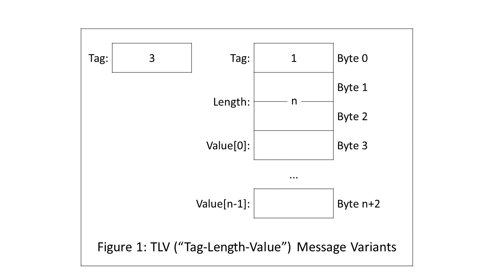
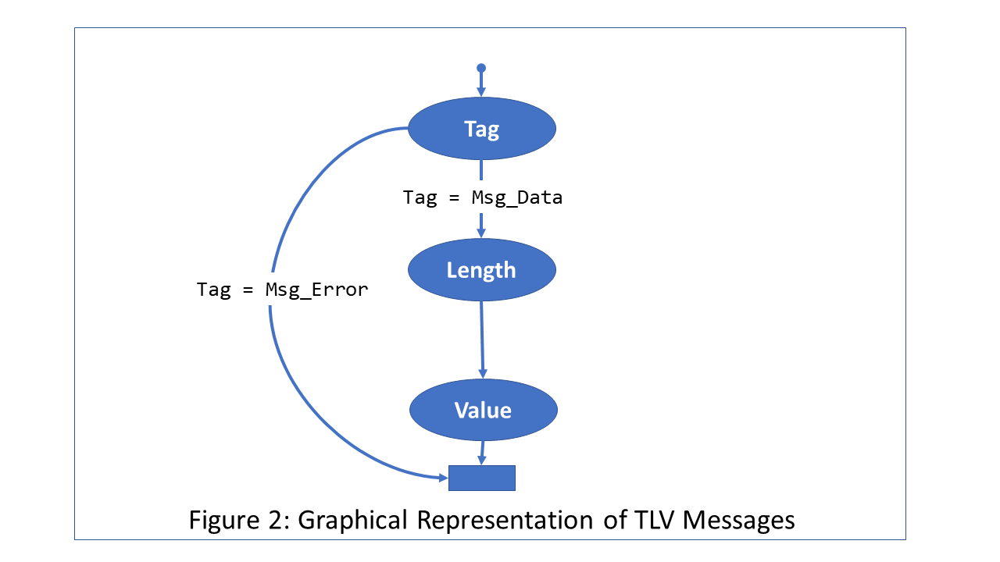
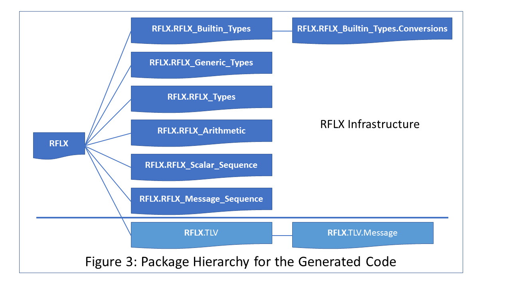

.. _Getting_Started_With_RecordFlux:

Getting Started with RecordFlux
~~~~~~~~~~~~~~~~~~~~~~~~~~~~~~~

This chapter introducess the basic features of the RecordFlux toolset
through a simple but representative example.

.. _What_Is_RecordFlux:

What Is RecordFlux?
===================

.. TODO:: Summarize main properties, maybe some history

.. _Example:

Example
=======

.. index:: TLV Example

The example below shows how to use RecordFlux to define the layout of a
binary message, verify its syntax, generate code to construct and
parse messages, formally prove that the generated code is free of
run-time errors, and conduct a session that processes a sample
message.

The source code for the example is in the file :file:`tlv.rflx` in the
:file:`examples/tlv/` directory of the RecordFlux distribution.

Specifying the Message Structure
--------------------------------

The message structure is shown in Figure 1 and consists of three fields:

- ``Tag`` (8 bits),
- ``Length`` (16 bits), and
- ``Value``, whose length (in 8-bit bytes) is specified by
  the value in the ``Length`` field.

The ``Tag`` field can have either of two valid values:

- ``Msg_Data`` (represented by the integer value ``1``), or
- ``Msg_Error`` (represented by ``3``).

If a message's ``Tag`` field is ``Msg_Data``, the ``Length``
and ``Value`` fields immediately follow.
If a message's ``Tag`` field is ``Msg_Error``, only the ``Tag``
field is present.
A message with any other value for ``Tag`` is invalid.

A graphical depiction of the conditional nature of the messages is
shown in Figure 2.

The structure of messages is often non-linear (in fact a directed
acyclic graph) because of optional fields.
For this reason the RecordFlux syntax for message
specification uses a graph-based representation.
The order of fields is defined by ``then`` clauses, which are also
used to state conditions and properties ("aspects") for
the following field. A more detailed description can be found in
:ref:`syntax_reference`.

.. code:: ada
   :number-lines:

   package TLV is
   
      type Tag_Type    is (Msg_Data => 1, Msg_Error => 3)
         with Size => 8;
      type Length_Type is mod 2**16;

      type Message_Type is
         message
            Tag    : Tag_Type
               then Length
                  if Tag = Msg_Data
               then null
                  if Tag = Msg_Error;
            Length : Length_Type
               then Value
                  with Size => Length * 8;
            Value  : Opaque;
         end message;

   end TLV;

The syntax is derived from Ada and is intended to be easily human readable.

* Lines 1 and 19:

  Message specifications are grouped in named modules
  (Ada-like *packages*). As in Ada, names are not case sensitive.

* Line 3:

  ``Tag_Type`` is an enumeration type with the values ``Msg_Data``
  and ``Msg_Error``. These values have the representation ``1`` and ``3``,
  respectively.  
  The syntax ``with Size => 8`` (an Ada 2012 *aspect specification*)
  here specifies the number of bits that any ``Tag_Type`` value
  will occupy. 

* Line 4:

  ``Length_Type`` is a modular (i.e., unsigned integer) type
  with values ``0`` through ``2``\ :superscript:`16` ``- 1``.
  A value of a modular type implicitly has a ``Size`` aspect
  reflecting the minimum number of bits required, based on the modulus;
  thus 16 bits for ``Length_Type``.

.. TODO:: Check the statement about bits for a modular type

* Lines 6 through 17:

  The message type definition defines the type name
  and specifies the message fields.
  Message types are somewhat analogous to Ada record types but
  with a richer syntax to capture dependencies between fields.

* Lines 8 through 12:

  The ``Tag`` field has type ``Tag_Type``. 
  
    - If the value of ``Tag`` is ``Msg_Data`` then the
      ``Length`` field immediately follows.
      
    - If the value of ``Tag`` is ``Msg_Error`` then there are no
      further fields in the message.
  
    - The only valid values for ``Tag`` are ``Msg_Data`` (``1``) and
      ``Msg_Error`` (``3``). A function generated by RecordFlux can
      verify that a message has a valid value for ``Tag``.
  
* Lines 13 through 15:

  The ``Length`` field
  is of type ``Length_Type``; it is interpreted as
  the number of bytes in the ``Value`` field.
  ``Length`` is unconditionally followed by the ``Value`` field,
  and the ``Size`` aspect for ``Value`` reflects the number of bits
  required.

* Line 16:

  ``Message_Type`` does not place any
  constraints on the kind of data in its payload
  (the ``Value`` field). RecordFlux reflects this generality via
  the special type ``Opaque``, which can be thought of as a
  sequence of bytes ("raw storage").
  The size of an opaque field (in bits) must be defined by a
  ``Size`` aspect, if another field can follow.
  If no ``Size`` aspect is given,
  the field size is implicitly defined by the available space
  (defined by the outer message when parsing or by the written
  data when serializing).  

  You can define type-specific derivatives of ``Message_Type``,
  for example with the ``Value`` field comprising an 8-byte
  unsigned integer representing an encrypted password,
  by using a RecordFlux facility known as
  *type refinement*. See section <TBD>.

Verifying the Message Structure
-------------------------------

RecordFlux is invoked from the command line with the :command:`rflx`
command. The sub-command :command:`check` will report an error if a
specification does not comply with the RecordFlux syntax.

.. index:: :command:`rflx check` command

A message specification file must have an ``rflx`` extension
and contain a single package definition.
The file name must be the same as the package name,
folded to lower case.

.. code-block:: sh

   $ rflx check tlv.rflx
   Parsing tlv.rflx
   Processing TLV
   $

Generating Code
---------------

The sub-command :command:`generate` is used to generate source code
based on the specification.
The :command:`rflx generate` command requires as arguments the names of
the target directory and the specification file(s).

.. index:: :command:`rflx generate` command

The source code is in Ada 2012 and includes annotations in SPARK
that can be used to formally prove a variety of message properties.

.. TODO:: Mention which properties can be proved

.. code-block:: sh

   $ mkdir generated
   $ rflx generate -d generated tlv.rflx
   Parsing tlv.rflx
   Processing TLV
   Creating generated/rflx-tlv.ads
   Creating generated/rflx-tlv-message.ads
   Creating generated/rflx-tlv-message.adb
   Creating generated/rflx-rflx_arithmetic.ads
   Creating generated/rflx-rflx_builtin_types-conversions.ads
   Creating generated/rflx-rflx_builtin_types.ads
   Creating generated/rflx-rflx_generic_types.ads
   Creating generated/rflx-rflx_message_sequence.ads
   Creating generated/rflx-rflx_scalar_sequence.ads
   Creating generated/rflx-rflx_types.ads
   Creating generated/rflx-rflx_arithmetic.adb
   Creating generated/rflx-rflx_generic_types.adb
   Creating generated/rflx-rflx_message_sequence.adb
   Creating generated/rflx-rflx_scalar_sequence.adb
   Creating generated/rflx.ads
   $

These files define a package hierarchy rooted at the empty
package ``RFLX``. The hierarchy comprises the RecordFlux
infrastructure together with application-specific packages
and is shown in Figure 3.

Package ``RFLX.TLV``
....................

The child package ``RFLX.TLV`` contains Ada type declarations
for the scalar types defined in the ``TLV`` package
(in the :file:`TLV.rflx` source file):

.. code:: ada

   type Tag_Type is (Msg_Data, Msg_Error) with Size => 8;
   for Tag_Type use (Msg_Data => 1, Msg_Error => 3);
   
   type Length_Type is mod 2**16;

Associated functions are declared for each of the types:

* Conversion: ``To_Base`` converts from the type to its "base"
  type (the modular type corresponding to the physical
  representations for values of the type), and ``To_Actual``
  converts in the other direction.
  
* Validity-checking: The ``Valid`` function returns a ``Boolean``
  value and checks whether
  the bit pattern for a value of the base type represents
  a valid value for the type.

Since ``Tag_Type`` has 8 bits as its ``Size``, ``Tag_Type_Base`` is
declared as ``mod 2**8``. The ``Valid`` function checks that the
value is either ``1`` or ``3``.

Since ``Length_Type`` has 16 bits as its ``Size``, the type is its
own base type; the conversion functions are basically "no-ops",
and ``Valid`` always returns ``True``.

Package ``RFLX.TLV.Message``
............................

This package declares an extensive set of types and subprograms
related to ``Message_Type``. The ones below illustrate the
main functionality. 

.. rubric:: Types

.. code:: ada

   type Virtual_Field is (F_Initial, F_Tag, F_Length, F_Value, F_Final);
   subtype Field is Virtual_Field range F_Tag .. F_Value;

..

   The ``Field`` (sub)type represents the ``Message_Type`` components.

.. code:: ada

   type Context
     (Buffer_First, 
      Buffer_Last : RFLX_Types.Index      := RFLX_Types.Index'First;
      First       : RFLX_Types.Bit_Index  := RFLX_Types.Bit_Index'First;
      Last        : RFLX_Types.Bit_Length := RFLX_Types.Bit_Length'First)
   is private;

..

   A ``Context`` object represents the message data along with state
   information.
   It encapsulates a ``Bytes_Ptr`` (an access value field, in
   the full declaration of ``Context`` in the private part of the package)
   that references  an array of bytes comprising the message.
   The ``Bytes_Ptr`` type is declared in package ``RFLX.RFLX_Builtin_Types``. 

   .. TODO:: Need some explanation of the various index parameters 

.. rubric:: Initialization

.. code:: ada

   procedure Initialize (Ctx : out Context; Buffer : in out Bytes_Ptr);

..

   Initialize ``Ctx`` with ``Buffer`` and then set ``Buffer``
   to ``null``.

.. code:: ada

   procedure Initialize (Ctx          : out Context; 
                         Buffer       : in out Bytes_Ptr;
                         Written_Last : Bit_Length := 0);

..

   Initialize ``Ctx`` with ``Buffer``, where ``Written_Last``
   is the position of the last bit of the data to be parsed
   within ``Buffer``,
   and then set ``Buffer`` to ``null``.
   ``Bit_Length`` is declared in ``RFLX.RFLX_Types``.

.. rubric:: Buffer operations

.. code:: ada

   procedure Take_Buffer (Ctx : in out Context; Buffer : out Bytes_Ptr);

..

   Retrieve ``Buffer`` and remove it from ``Ctx``
   (i.e., set ``Ctx``\ 's ``Bytes_Ptr`` field to ``null``).
   Note: ``Buffer`` cannot subsequently be assigned back into ``Ctx``;
   thus further verification of the message is not possible after
   this action.

.. code:: ada

   function Has_Buffer (Ctx : Context) return Boolean;

..

   Check if ``Ctx`` contains a non-null buffer ``Bytes_Ptr``.

.. rubric:: Field "setter" operations

.. code:: ada

   procedure Set_Tag    (Ctx : in out Context; Value : Tag);
   procedure Set_Length (Ctx : in out Context; Value : Length);
   
..

   Set the ``Tag`` and ``Length`` fields, respectively

.. code:: ada

   procedure Set_Value_Empty (Ctx : in out Context);

..   

   Set the ``Value`` field to empty.
   
   .. TODO:: What does it mean for the ``Value`` field to be empty?

.. code:: ada

   procedure Set_Value (Ctx : in out Context; Value : Bytes);

..

  Set the contents of the ``Value`` field.

.. code:: ada

   generic 
      with procedure Process_Value (Value : Bytes);
   procedure Generic_Set_Value (Ctx : in out Context);

..

   Invoke the ``Process_Value`` procedure on the contents of the
   ``Value`` field.

.. code:: ada

   procedure Initialize_Value (Ctx : in out Context);

..

   Initialize the ``Value`` field (a precondition to switching context for
   generating the contained message).

   .. TODO:: What does initialization do?

.. rubric:: Field "getter" operations

.. code:: ada

   function Get_Tag    (Ctx : Context) return RFLX.TLV.Tag_Type;
   function Get_Length (Ctx : Context) return RFLX.TLV.Length_Type;
   function Get_Value  (Ctx : Context) return RFLX_Types.Bytes;

   procedure Get_Value (Ctx : Context; Data : out RFLX_Types.Bytes);

   generic
      with procedure Process_Value (Value : RFLX_Types.Bytes);
   procedure Generic_Get_Value (Ctx : Context);

..

  These are analogous to the "setter" operations above.
  
  .. TODO:: For the ``Get_Value`` procedure, what happens if the
     length of the ``Data`` array is different from the length
     of the buffer?

.. rubric:: Field and Message Validation

.. code:: ada

   function             (Ctx : Context; Fld : Field) return Boolean;
   function Invalid     (Ctx : Context; Fld : Field) return Boolean;
   function Incomplete  (Ctx : Context; Fld : Field) return Boolean;
   function Well_Formed (Ctx : Context; Fld : Field) return Boolean;
   function Valid       (Ctx : Context; Fld : Field) return Boolean;

   function Incomplete_Message  (Ctx : Context) return Boolean;
   function Well_Formed_Message (Ctx : Context) return Boolean;
   function Valid_Message       (Ctx : Context) return Boolean;
   
   procedure Verify         (Ctx : in out Context; Fld : Field);
   procedure Verify_Message (Ctx : in out Context);

..

   RecordFlux generates a number of subprograms that check the validity
   of an entire messsage or individual fields. These subprograms are
   based on the concept that a field can be in one of several states:

   * *Invalid*. For example, a ``Tag`` field containing a bit pattern
     other than ``1`` or ``3`` is invalid (perhaps due to channel noise).

   * *Incomplete*.
   
     .. TODO:: What does it mean for a field to be incomplete?

   * *Well-formed*. Scalar fields are always well-formed.
     An opaque field is well-formed if its
     length and bounds have been set.

   * *Valid* A field is valid if it is well-formed and
     its representation contains a bit pattern that is valid
     based on its type. An opaque field is only valid if
     it has been refined to a specific type and its bit
     pattern is valid for that type.

   The ``Verify`` and ``Verify_Message`` procedures set internal
   state in ``Ctx`` and will raise ``Assertion_Error`` if
   the field or message is not well-formed.
   
   .. TODO:: Check the description of ``Verify`` and ``Verify_state``.
      Do they only check for well-formedness?

The ``RFLX.TLV.Message`` package makes heavy use of
Ada contracts (pre- and postconditions, type predicates) as well as
other aspects that are specific to SPARK.
These facilitate formal analysis by the SPARK tools and also
serve as precise documentation for the human reader.

Some functions are only used only for formal analysis
and are thus declared with SPARK's ``Ghost`` aspect.

Constructing a Message
----------------------

The following program constructs a TLV message and inspects its
contents:

.. code:: ada
   :number-lines:

   with Ada.Text_IO;
   with RFLX.RFLX_Builtin_Types;
   with RFLX.TLV.Message; use RFLX.TLV.Message; 
   procedure Generate_TLV is
      Buffer  : RFLX.RFLX_Builtin_Types.Bytes_Ptr :=
        new RFLX.RFLX_Builtin_Types.Bytes(1..7);

      Ctx : Context;

      use type RFLX.RFLX_Builtin_Types.Bytes;

   begin
      --  Generate message
      Initialize (Ctx, Buffer);

      -- Message is not yet valid
      if not Valid_Message (Ctx) then
         Ada.Text_IO.Put_Line ("Expected");
      else
         Ada.Text_IO.Put_Line ("Unexpected");
      end if;

      Set_Tag    (Ctx, RFLX.TLV.Msg_Data);
      Set_Length (Ctx, 4);
      Set_Value  (Ctx, (10, 20, 30, 40));

      -- Verify field status
      if Valid (Ctx, F_Tag)
         and Valid (Ctx, F_Length)
         and Well_Formed (Ctx, F_Value)
         and not Valid (Ctx, F_Value)
      then
         Ada.Text_IO.Put_Line ("Expected");
      else
         Ada.Text_IO.Put_Line ("Unexpected");
      end if;

      --  Inspect message contents
      Take_Buffer (Ctx, Buffer);
      if Buffer.all = (1, 0, 4, 10, 20, 30, 40) then
         Ada.Text_IO.Put_Line ("Expected");
      else
         Ada.Text_IO.Put_Line ("Unexpected");
      end if;
   end Generate_TLV;

Note that, as an opaque field, the ``Value`` field is
well-formed but not valid (lines 30 and 31),
since it has not been refined.

Executing the program produces the following output:
   
.. code-block:: sh

   $ ./generate_tlv
   Expected
   Expected
   Expected

Parsing a Message
----------------------

The following program decomposes a TLV message into its
constituent fields:

.. code:: ada
   :number-lines:

   with Ada.Text_IO; use Ada.Text_IO;
   with RFLX.RFLX_Types;
   with RFLX.RFLX_Builtin_Types;
   with RFLX.TLV.Message; use RFLX.TLV.Message;
   procedure Parse_TLV is

      Buffer  : RFLX.RFLX_Builtin_Types.Bytes_Ptr := 
        new RFLX.RFLX_Builtin_Types.Bytes'(1, 0, 4, 10, 20, 30, 40);
      Ctx       : Context;
      Tag       : RFLX.TLV.Tag_Type;
      Length    : RFLX.TLV.Length_Type;
      Value_Ref : RFLX.RFLX_Builtin_Types.Bytes_Ptr;

   begin
      Initialize (Ctx, 
                  Buffer,
                  Written_Last => 
                     RFLX.RFLX_Types.To_Last_Bit_Index (Buffer'Last));
 
      Verify_Message (Ctx);

      if Well_Formed_Message (Ctx) then
         Tag := Get_Tag (Ctx);
         Put_Line ("Tag field is " & Tag'Img);
         case Tag is
            when RFLX.TLV.Msg_Data =>
               Length := Get_Length (Ctx);
               Put_Line( "Length field is " & Length'Img);
               if Present (Ctx, F_Value) then
                  Value_Ref := 
                     new RFLX.RFLX_Types.Bytes'( Get_Value(Ctx) );
                  Put ("Value field is ( ");
                  for Byte_Val of Value_Ref.all loop
                     Put( Byte_Val'Img & ' ');
                  end loop;
                  Put_Line ( ")" ); 
               else
                  Ada.Text_IO.Put_Line ("Data message without value");
               end if;
            when RFLX.TLV.Msg_Error =>
               Ada.Text_IO.Put_Line ("Error message");
         end case;
      else
         Ada.Text_IO.Put_Line ("Invalid message");
      end if;
   end Parse_TLV;

* Lines 7-8

  The message to be parsed is created as "raw storage" (a ``Bytes``
  array). The ``Buffer`` variable points to an allocated copy of
  the array.

* Lines 15-18

  ``Ctx`` is initialized with ``Buffer``, and ``Buffer'Last`` is
  identified as the last element.

* Line 20

  .. TODO:: Explain  what ``Verify_Message`` does

* Line 29

  .. TODO:: Explain  why ``Present`` is called

Executing the program produces the following output:

.. code-block:: sh

   $ ./parse_tlv
   Tag field is MSG_DATA
   Length field is  4
   Value field is (  10  20  30  40 )

   